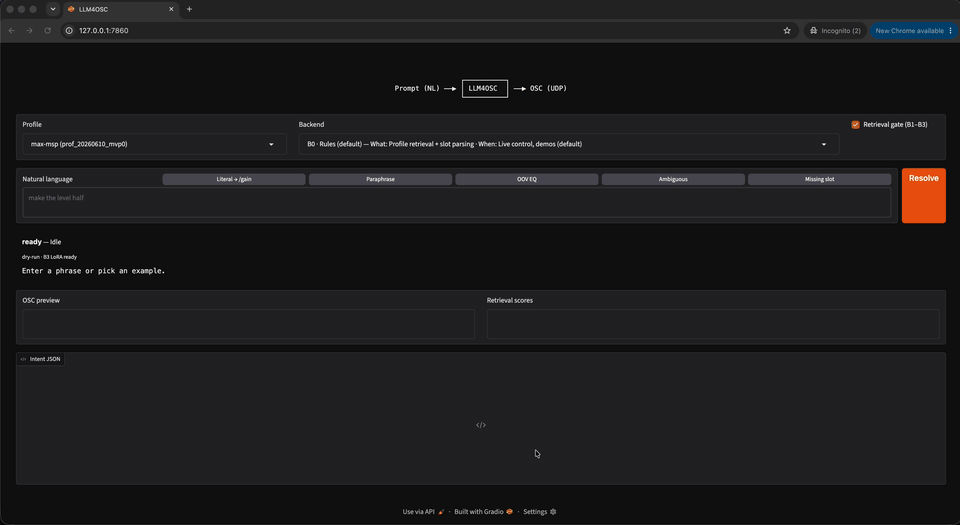

# LLM4OSC



<br>

[](https://arxiv.org/abs/2607.26024)

<br>

```
                ┌──────────┐
Prompt (NL) ──▶ │ LLM4OSC  │ ──▶ OSC (UDP)
                └──────────┘
```

**Don't let the LLM touch the wire.**

Natural language → structured intent → validated OSC. Models *propose* JSON over a versioned device profile; deterministic code *decides* what hits UDP. Same validated intent → same OSC bytes. Out-of-profile input is refused, not guessed.

Follow-on to [MCP2OSC](https://github.com/yyf/MCP2OSC) (NeurIPS 2025 Creative AI Track).

```
device profile  +  natural language
        ↓
   intent JSON  (proposed)
        ↓
   validate → clamp → encode → OSC
```

## Install

```bash
python3 -m venv .venv && source .venv/bin/activate
pip install -e ".[dev]"
```

LLM backends (`b1`–`b3`): `pip install -e ".[dev,llm]"`

## Quick start

```bash
llm4osc send --device max-msp --nl "set gain to 50%" --dry-run -y      # literal
llm4osc send --device max-msp --nl "make the level half" --dry-run -y   # paraphrase → /gain 0.5
llm4osc send --device max-msp --nl "boost the bass band by 3db" --dry-run -y  # refuses
llm4osc send --device max-msp --nl "set gain to 50%" -y                 # live → 127.0.0.1:7400
```

Max/MSP: `[udpreceive 7400]`. `LLM4OSC_HOST` / `LLM4OSC_PORT` to override.

```bash
python scripts/osc_listen.py
llm4osc profile list-patterns --device max-msp
```

Default backend: **B0** (rules + slot fill, no GPU).

## Demo UI

Local Gradio panel: swap **committed profile**, **backend** (B0–B3), dry-run / refuse preview, and optional **retrieval gate off** to show wrong-send risk. LoRA is a **B3** preset (preloaded adapter path) — not drag‑drop weights.

```bash
pip install -e ".[demo]"
python demo/app.py
# or: llm4osc demo
```

See [`demo/README.md`](demo/README.md).

## Backends

| Backend | What                             | When                          |
|---------|----------------------------------|-------------------------------|
| **b0**  | Profile retrieval + slot parsing | Live control, demos (default)   |
| b1      | Qwen2-0.5B zero-shot             | Baseline only                 |
| b2      | Qwen + few-shot                  | Baseline only                 |
| b3      | Qwen + LoRA + NL refine          | Paraphrase experiments        |

`--backend b0|b1|b2|b3` · `LLM4OSC_DEBUG=1` · `LLM4OSC_MODEL` · `LLM4OSC_ADAPTER`

```bash
llm4osc serve                                    # load Qwen once
export LLM4OSC_SERVE_URL=http://127.0.0.1:8765   # reuse in other shells
```

## Evaluation

Frozen Max/MSP holdout suite (excluded from LoRA training): **8 literal + 8 paraphrase + 4 refusal** on profile `prof_20260610_mvp0` (12 patterns).

Primary safety metric: **wrong-send rate** — mismatched intents that would pass Tier 3 dry-run and transmit OSC. Missed commands (safe refusals) do not count.

Release gates: semantic accuracy ≥ 90%, **wrong-send rate 0%**. CI enforces B0 on literal + refusal (`pytest`, `llm4osc score`). Source: [`benchmarks/results/track_c.json`](benchmarks/results/track_c.json). B3 recipe: [`models/qwen2-0.5b-osc/model_card.md`](models/qwen2-0.5b-osc/model_card.md).

`—` = not reported in that snapshot.

| Run              | Date       | Backend | Suite      | Sem. acc. | Wrong-send | Refusal P | Refusal R | Repro | p50     | p95     | Gates |
|------------------|------------|---------|------------|-----------|------------|-----------|-----------|-------|---------|---------|-------|
| Track C          | 2026-07-07 | **B0**  | literal    | 100%      | 0%         | 100%      | 100%      | 100%  | 0.05 ms | 0.22 ms | pass  |
| Track C          | 2026-07-07 | B1      | literal    | 100%      | 0%         | 100%      | 100%      | 100%  | 3.68 s  | 11.13 s | pass  |
| Track C          | 2026-07-07 | B2      | literal    | 100%      | 0%         | 100%      | 100%      | 100%  | 4.27 s  | 5.39 s  | pass  |
| Track C          | 2026-07-07 | B3      | literal    | 100%      | 0%         | 100%      | 100%      | 100%  | 3.52 s  | 3.82 s  | pass  |
| Track C          | 2026-07-07 | **B0**  | paraphrase | 100%      | 0%         | 100%      | 100%      | 100%  | 0.06 ms | 0.08 ms | pass  |
| Track C          | 2026-07-07 | B1      | paraphrase | 100%      | 0%         | 100%      | 100%      | 100%  | 3.85 s  | 4.39 s  | pass  |
| Track C          | 2026-07-07 | B2      | paraphrase | 100%      | 0%         | 100%      | 100%      | 100%  | 3.83 s  | 5.14 s  | pass  |
| Track C          | 2026-07-07 | B3      | paraphrase | 100%      | 0%         | 100%      | 100%      | 100%  | 3.77 s  | 4.02 s  | pass  |
| Pre-gate         | 2026-06-28 | B1      | literal    | 37.5%     | 27.3%      | 100%      | 0%        | 100%  | 2.95 s  | 3.82 s  | fail  |
| Pre-gate         | 2026-06-28 | B1      | paraphrase | 12.5%     | 37.5%      | 100%      | —         | 100%  | 2.92 s  | 4.00 s  | fail  |
| Pre-gate         | 2026-06-28 | B2      | literal    | 62.5%     | 9.1%       | 100%      | 33.3%     | 100%  | 3.14 s  | 5.00 s  | fail  |
| Pre-gate         | 2026-06-28 | B2      | paraphrase | 62.5%     | 12.5%      | 100%      | —         | 100%  | 2.72 s  | 6.26 s  | fail  |
| Pre-gate (B3 v1) | —          | B3      | literal    | 100%      | —          | —         | —         | —     | —       | —       | —     |
| Pre-gate (B3 v1) | —          | B3      | paraphrase | 62.5%     | —          | —         | —         | —     | —       | —       | —     |
| Historical       | 2026-06-25 | B0      | lit+refuse | 100%      | 0%         | 100%      | 100%      | 100%  | 0.04 ms | 0.24 ms | pass  |
| Historical       | 2026-06-25 | B1      | lit+refuse | 25%       | 9.1%       | 100%      | 0%        | 100%  | 3.18 s  | 11.58 s | fail  |

**Notes:** Track C is the current frozen scorecard with retrieval gate — literal = 8 NL + 4 refuse, paraphrase = 8 NL only (`track_c.json`). Pre-gate rows are ungated LLM snapshots (`b1_literal.json`, `b1_paraphrase.json`, `b2_literal.json`, `b2_paraphrase.json`); refusal suite then had **3** cases (before `refuse_oov_eq`). Pre-gate (B3 v1) is LoRA only, before NL refine + gate. Historical rows are single combined lit+refuse scorecards (`baseline.json`, `b1.json`; 8 NL + 3 refuse), not split by suite.

Literal↔paraphrase gap on Track C (sem. acc.): **0 pts** for B0–B3. Scorecard recommendation: demo **B0**; LoRA not required for this suite (`lora_recommended: false`).

B1–B3 on Track C re-apply B0’s refuse policy after the model proposes JSON. Gated pass ≠ model competence — the gate carries refusal. Use **B0** for live control (sub-ms, no GPU).

```bash
pytest
llm4osc score
llm4osc score --suite paraphrase
llm4osc score-compare --backends b0,b1,b2,b3 --adapter models/qwen2-0.5b-osc/adapter
```

### Train B3 (optional)

Weights gitignored — reproduce locally:

```bash
llm4osc train-data --device max-msp
pip install -e ".[train]" && python training/train_lora.py
```

## Limitations

- One device profile (Max/MSP, 12 patterns) — other rigs need new profiles
- Small benchmark (20 NL-facing cases); passing gates ≠ show-day coverage
- B1–B3 unsafe without retrieval gate + Tier 3; LLM path ~3–4 s p50
- Text NL only — no speech, MCP server, or automated manual ingest

## Layout

`llm4osc/` · `tier3/` · `profiles/committed/` · `benchmarks/` · `schemas/` · `training/` · `demo/`

## License

MIT
